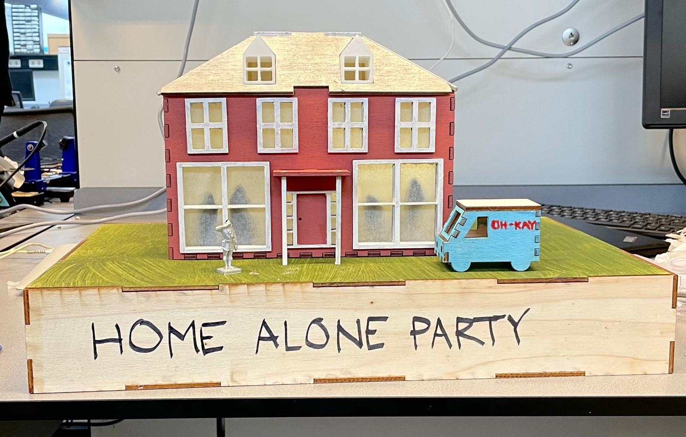
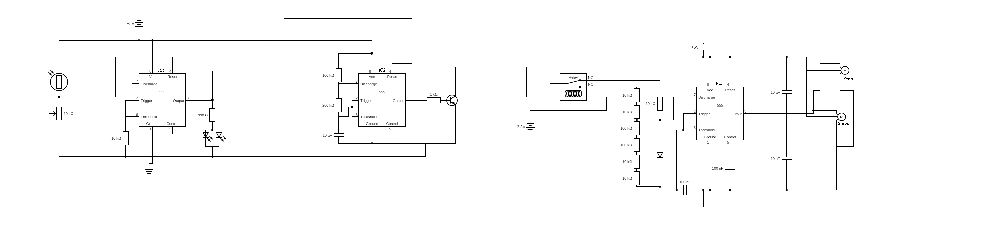

# "Home Alone" Instalation
During a 4 day hackathon, in a group of 4 people we've made a interactive installation of one of the "Home Alone" scenes. The installation combined 3d-printing, laser cutting and electronics to recreate scene where the main character fakes a party in his home to spook the burglars. 

I've worked on the electronics part of the project. Using 3 NE555 timers, three sub-circuits were built. First, NE555 circuit with an LDR turns on/off the LEDs and the astable multivibrator circuit. This astable circuit then controls servo motors, by sending PWM signals of different duty cycles, which move the "people" inside.

This was my first ever electronics project and it was very interesting to learn about NE555 timers, servo motors and how to combine sensors and actuators in analog way, without using microcontrollers such as Arduino.

